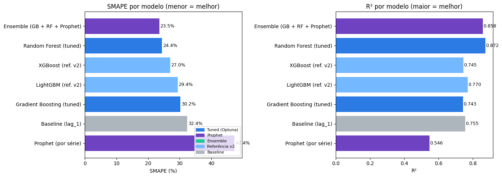
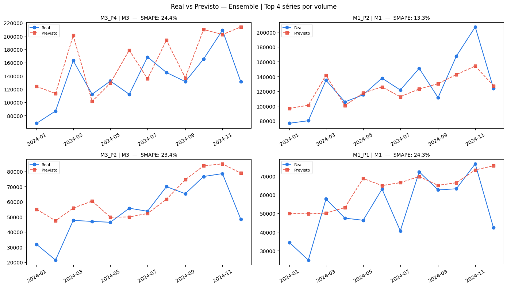

# Sales Forecasting with Ensemble Models

## Business Problem

Accurate sales forecasting is critical for inventory planning, revenue projection, and strategic decision-making.

This project delivers a machine learning pipeline to generate reliable 12-month forecasts across multiple product-market combinations, improving accuracy compared to baseline approaches.

## TL;DR

* Ensemble model (Gradient Boosting + Random Forest + Prophet)
* Hyperparameter tuning with Optuna
* Weight optimization with SciPy
* Reduced SMAPE by 8.8 pp vs baseline
* 12-month forward projections generated

## Business Impact

* Improves demand planning accuracy
* Supports better inventory and production decisions
* Reduces risks of overstocking and stockouts
* Enables reliable market share estimation based on forecasted demand

---

> The notebook reads data from and writes outputs to Google Drive. Path references follow a Colab + Drive setup and should be adjusted for other environments.

---

## Dataset

- **Granularity:** Monthly
- **Period:** January 2021 – December 2024
- **Series:** ~12 anonymized product-market combinations (`Prod_anom` × `Merc_anom`)
- **Target variable:** `Unidades` (sales volume)
- All identifiers have been anonymized for this publication.

---

## Methodology

### 1. Feature Engineering

| Group | Features |
|---|---|
| Lagged values | `lag_1`, `lag_3`, `lag_6`, `lag_12` |
| Rolling averages | `rolling_mean_3`, `rolling_mean_6`, `rolling_mean_12` |
| Calendar | Month, year |
| Trend | Cumulative time index per series |
| Target encoding | Mean sales per product and per market (computed on training data only) |

### 2. Validation Strategy

- **Train set:** January 2021 – December 2023
- **Test set:** January – December 2024
- **Cross-validation:** `TimeSeriesSplit` with 4 folds, used during hyperparameter tuning

No random shuffling is applied at any stage to preserve temporal ordering.

### 3. Models

| Model | Role |
|---|---|
| Gradient Boosting (Optuna-tuned) | Primary ensemble component |
| Random Forest (Optuna-tuned) | Primary ensemble component |
| Prophet (per-series) | Primary ensemble component |
| XGBoost (default) | Benchmark |
| LightGBM (default) | Benchmark |
| Lag-1 Naive | Baseline |

**Why GB and RF over XGBoost/LightGBM?** With ~12 series, simpler models with fewer parameters generalize more reliably. Empirically, GB and RF outperformed the boosting alternatives on the hold-out test set.

**Why Prophet per series?** Prophet handles short time series with seasonal patterns without requiring manual feature engineering. Training one model per series lets it adapt individually to each product-market's dynamics.

### 4. Ensemble

The three primary models are combined with a weighted average. Weights are optimized via `scipy.optimize.minimize` (Nelder-Mead) to minimize SMAPE on the 2024 test set, starting from equal weights (1/3 each).

### 5. Projection Strategy

The 12-month forward forecast (Jan–Dec 2025) uses an **iterative multi-step** approach:

- In each future month, lag and rolling average features are recomputed using the combination of real historical data and previously generated forecasts.
- This replicates production behavior, where future actuals are never available at inference time.

---

## Evaluation Metric

**SMAPE** (Symmetric Mean Absolute Percentage Error) is the primary metric throughout:

$$\text{SMAPE} = \frac{1}{n} \sum_{t=1}^{n} \frac{|y_t - \hat{y}_t|}{(|y_t| + |\hat{y}_t|) / 2} \times 100$$

SMAPE is preferred over MAPE here because the dataset contains near-zero values that would cause MAPE to become unstable or undefined.

---

## Results

Evaluated on the 2024 hold-out test set (January – December 2024, unseen during training and tuning).

### Model comparison




| Rank | Model | SMAPE | MAPE | MAE | RMSE | R² |
|------|-------|------:|-----:|----:|-----:|---:|
| 🥇 | Ensemble (GB + RF + Prophet) | 23.54% | 34.17% | 9,691 | 16,519 | 0.858 |
| 2 | Random Forest (tuned) | 24.39% | 38.66% | 9,769 | 15,641 | 0.872 |
| 3 | XGBoost (ref.) | 26.95% | 36.58% | 11,830 | 22,115 | 0.745 |
| 4 | LightGBM (ref.) | 29.36% | 42.54% | 13,132 | 20,991 | 0.770 |
| 5 | Gradient Boosting (tuned) | 30.25% | 36.88% | 12,158 | 22,164 | 0.743 |
| 6 | Baseline (lag-1 naive) | 32.37% | 43.30% | 13,785 | 21,642 | 0.755 |
| 7 | Prophet (per series) | 47.37% | 48.00% | 18,794 | 29,472 | 0.546 |

The ensemble reduced SMAPE by **8.8 percentage points** relative to the naive baseline and outperformed every individual model on that metric. Random Forest (tuned) achieved the best R² and RMSE individually, which reinforces its weight in the ensemble.

Prophet underperformed as a standalone model on this dataset — likely due to the short series length and high inter-series variance — but contributed positively to the ensemble, suggesting it captured patterns that the tree-based models partially missed.

### Per-series breakdown (Ensemble)

| Product | Market | SMAPE | MAE |
|---------|--------|------:|----:|
| M1_P1 | M1 | 24.3% | 12,362 |
| M1_P2 | M1 | 13.3% | 17,073 |
| M1_P3 | M1 | 12.2% | 3,774 |
| M1_P4 | M1 | 17.2% | 8,469 |
| M2_P1 | M2 | 29.5% | 1,545 |
| M2_P2 | M2 | 29.8% | 1,898 |
| M2_P3 | M2 | 9.1% | 4,371 |
| M2_P4 | M2 | 13.5% | 4,235 |
| M3_P1 | M3 | 25.9% | 6,416 |
| M3_P2 | M3 | 23.4% | 11,918 |
| M3_P3 | M3 | 59.9% | 9,089 |
| M3_P4 | M3 | 24.4% | 35,138 |

Most series fall in the 9–30% SMAPE range. The outlier is **M3_P3** (59.9%), which likely reflects irregular demand patterns or structural breaks not captured by the available features. **M3_P4** shows the highest absolute error (MAE 35,138), consistent with it being a high-volume series where percentage errors translate into larger absolute deviations.

Here is the comparison between real results against the model projections in the test step:



---

## Output

The final Excel workbook (`Projecoes_2025.xlsx`) contains three sheets:

| Sheet | Content |
|---|---|
| Projeção por Produto | Pivot table: products × months, with annual total |
| Detalhe Produto-Mercado | Granular view: one row per series per month |
| Métricas do Modelo | Full model comparison from the 2024 evaluation |

---

## Requirements

```
pandas
numpy
scikit-learn
xgboost
lightgbm
prophet
optuna
scipy
matplotlib
seaborn
openpyxl
```

Install all dependencies:

```bash
pip install pandas numpy scikit-learn xgboost lightgbm prophet optuna scipy matplotlib seaborn openpyxl
```

> The notebook includes `!pip install` cells for the packages not available by default in Google Colab.

---

## How to Run

1. Open the notebook in [Google Colab](https://colab.research.google.com/)
2. Mount your Google Drive when prompted
3. Update the `path` variable in Section 1 to point to your data file
4. Run all cells sequentially

The projection output will be saved automatically to the path defined in Section 15.

---

## Key Design Decisions

- **SMAPE over MAPE** — avoids division-by-zero instability on near-zero sales months
- **Optuna over grid search** — more efficient exploration of large hyperparameter spaces with fewer trials
- **Iterative multi-step projection** — correctly propagates uncertainty through the forecast horizon without leaking future values into lag features
- **Per-series Prophet** — each series gets its own trend and seasonality model rather than a pooled approximation
- **Scipy weight optimization** — ensemble weights are data-driven, not manually assigned

---

## Final Takeaways

- Ensemble models outperform individual approaches for this dataset
- Combining ML and time-series methods improves robustness
- The pipeline is production-ready for iterative forecasting scenarios
